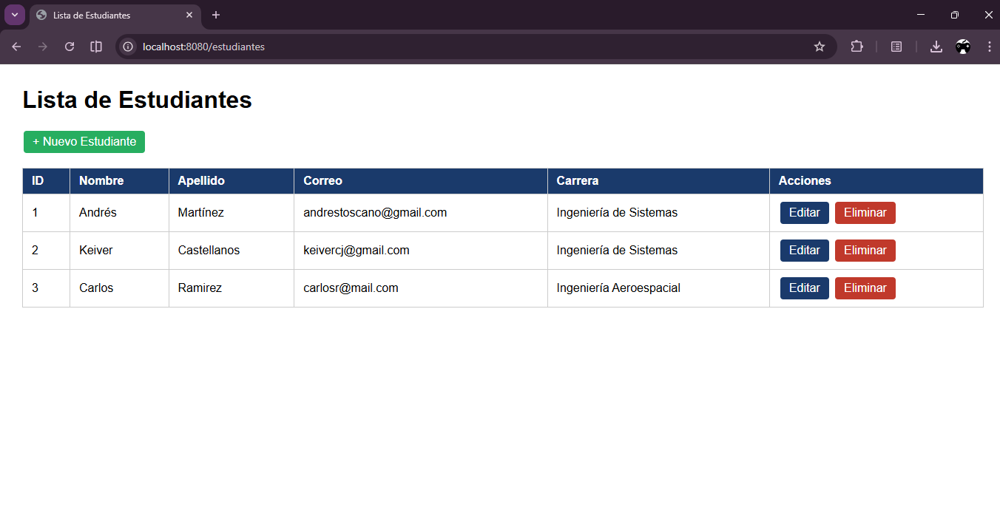
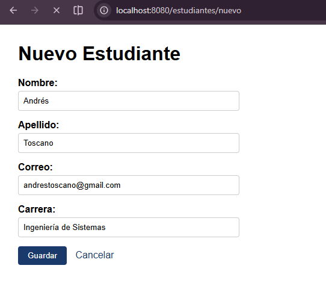
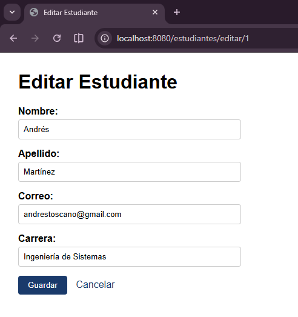

# estudiantes-post1-u8

CRUD completo de la entidad **Estudiante** usando Spring Boot, Spring Data JPA e Hibernate, conectado a MySQL.

---

## Requisitos previos

- Java 17 o superior
- MySQL 8.x en ejecución
- Maven 3.x (incluido en el wrapper del proyecto)
- IntelliJ IDEA o VS Code con extensiones Java

---

## Configuración de MySQL

Abre tu terminal y ejecuta:

```sql
mysql -u root -p
```

Luego crea la base de datos y el usuario:

```sql
CREATE DATABASE estudiantes_db CHARACTER SET utf8mb4 COLLATE utf8mb4_unicode_ci;
CREATE USER 'appuser'@'localhost' IDENTIFIED BY 'apppass';
GRANT ALL PRIVILEGES ON estudiantes_db.* TO 'appuser'@'localhost';
FLUSH PRIVILEGES;
EXIT;
```

---

## Configuración de application.properties

El archivo se encuentra en `src/main/resources/application.properties`:

```properties
# Conexión a MySQL
spring.datasource.url=jdbc:mysql://localhost:3306/estudiantes_db?useSSL=false&serverTimezone=UTC&allowPublicKeyRetrieval=true
spring.datasource.username=appuser
spring.datasource.password=apppass
spring.datasource.driver-class-name=com.mysql.cj.jdbc.Driver

# JPA / Hibernate
spring.jpa.hibernate.ddl-auto=update
spring.jpa.show-sql=true
spring.jpa.properties.hibernate.format_sql=true

# Puerto del servidor
server.port=8080
```

> Hibernate detecta el dialecto de MySQL automáticamente. No es necesario especificarlo manualmente.

---

## Ejecución del proyecto

Desde la raíz del proyecto ejecuta:

**Linux / Mac:**
```bash
./mvnw spring-boot:run
```

**Windows:**
```bash
mvnw.cmd spring-boot:run
```

La aplicación estará disponible en: `http://localhost:8080/estudiantes`

---

## Estructura del proyecto

```
src/main/java/com/universidad/estudiantes/
├── EstudiantesApplication.java
├── controller/
│   └── EstudianteController.java
├── model/
│   └── Estudiante.java
├── repository/
│   └── EstudianteRepository.java
└── service/
    └── EstudianteService.java

src/main/resources/
├── application.properties
└── templates/
    └── estudiantes/
        ├── lista.html
        ├── formulario.html
        └── confirmar-eliminar.html
```

---

## Operaciones CRUD disponibles

| Operación | Método | Ruta |
|-----------|--------|------|
| Listar estudiantes | GET | `/estudiantes` |
| Formulario nuevo | GET | `/estudiantes/nuevo` |
| Guardar estudiante | POST | `/estudiantes/guardar` |
| Formulario editar | GET | `/estudiantes/editar/{id}` |
| Confirmar eliminación | GET | `/estudiantes/eliminar/{id}` |
| Ejecutar eliminación | POST | `/estudiantes/eliminar/{id}` |

---

## Capturas de pantalla

### Lista de estudiantes
Muestra todos los estudiantes registrados en la base de datos con opciones para editar o eliminar cada uno.



---

### Formulario para agregar un estudiante
Permite registrar un nuevo estudiante con validación de campos en tiempo real.



---

### Formulario para editar un estudiante
Permite modificar los datos de un estudiante existente, cargando sus datos actuales en el formulario.



---

## Verificación en base de datos

Puedes confirmar que los datos se están persistiendo correctamente ejecutando en MySQL:

```sql
USE estudiantes_db;
SHOW TABLES;
SELECT * FROM estudiantes;
```

---

## Tecnologías utilizadas

- Java 17
- Spring Boot 4.x
- Spring Data JPA
- Hibernate 7
- MySQL 8
- Thymeleaf
- Bean Validation (Jakarta)
- Maven